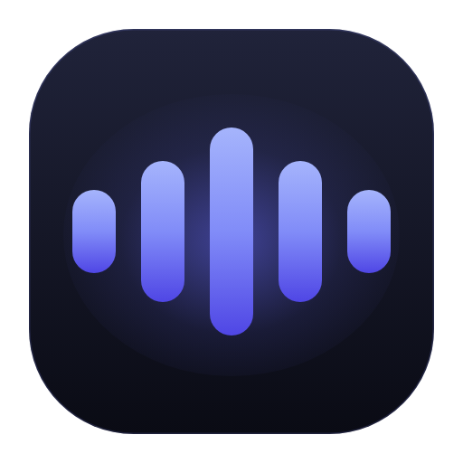
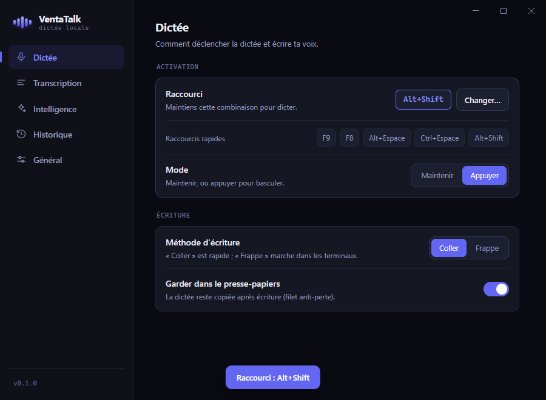

<div align="center">



# VentaTalk

**Dictée vocale système pour Windows — 100 % locale, 100 % privée.**

Maintiens un raccourci, parle, relâche → ton texte est transcrit, nettoyé, et écrit
**au curseur dans n'importe quelle application**. Rien ne quitte ton PC.

[](https://github.com/StyuDEV/VentaTalk/releases/latest)
&nbsp;




</div>

---

## ✨ Ce que ça fait

- 🎙️ **Dictée système** — un raccourci global (par défaut **F9**, maintenir), tu parles, le texte
  s'écrit là où est ton curseur. Marche dans **toutes** les apps (navigateur, Word, Discord, terminal…).
- ⚡ **Rapide** — transcription **whisper.cpp sur GPU** (CUDA NVIDIA / Vulkan AMD-Intel), modèle gardé en VRAM (~300 ms).
- 🧠 **Nettoyage IA local** — un petit LLM (Qwen) enlève les « euh », ponctue et corrige, **sans
  dénaturer ton style** (il garde ton registre, ton argot).
- 🔒 **Zéro cloud** — moteurs, modèles et historique restent sur ta machine. Aucune télémétrie.
- 🎛️ **Fait pour durer** — raccourcis personnalisés, dictionnaire de corrections, historique des
  dictées, sélecteur de micro, coupure du son pendant la dictée, mises à jour automatiques.

## ⬇️ Installation

1. Télécharge **[`VentaTalk-Setup-x.x.x.exe`](https://github.com/StyuDEV/VentaTalk/releases/latest)**.
2. Lance-le. *(App non signée → Windows peut afficher « Éditeur inconnu » : clique
   **Informations complémentaires → Exécuter quand même**.)*
3. Au 1er démarrage, un assistant te fait télécharger le **moteur GPU** + un **modèle** (≈ 1 Go).
4. Maintiens **F9**, parle, relâche. C'est tout.

> 💡 Les modèles se téléchargent une seule fois et sont stockés localement (`%APPDATA%/ventatalk`).

## 🛠️ Comment ça marche

```
Raccourci ─▶ capture micro (16 kHz, pré-roll anti-troncature)
          ─▶ VAD (coupe le silence)
          ─▶ whisper.cpp GPU  ─▶  transcription
          ─▶ disfluences + dictionnaire + nettoyage LLM
          ─▶ écriture au curseur (coller / frappe)
```

100 % hors-ligne : aucune requête réseau pendant l'usage (hors téléchargement initial des modèles).

## 🧱 Stack

**Electron** + **electron-vite** (TypeScript) · **whisper.cpp** (transcription GPU) ·
**node-llama-cpp** (LLM de nettoyage, GPU Vulkan) · **uiohook-napi** (raccourci global) ·
**nut-js** (injection texte) · packaging **electron-builder** (installeur NSIS).

## 👩‍💻 Build depuis le source

```bash
npm install
npm run dev      # app en tray (electron-vite)
npm run build    # bundle dans out/
npm run dist     # installeur Windows dans dist/
```

Voir **[RELEASING.md](RELEASING.md)** pour publier une version + l'auto-update.

## 🔐 Vie privée

VentaTalk ne collecte **rien** : pas de compte, pas de serveur, pas de statistiques d'usage.
Ta voix, tes transcriptions et ton historique ne sortent jamais de ton ordinateur.

---

<div align="center"><sub>Fait par <a href="https://github.com/StyuDEV">StyuDEV</a></sub></div>
